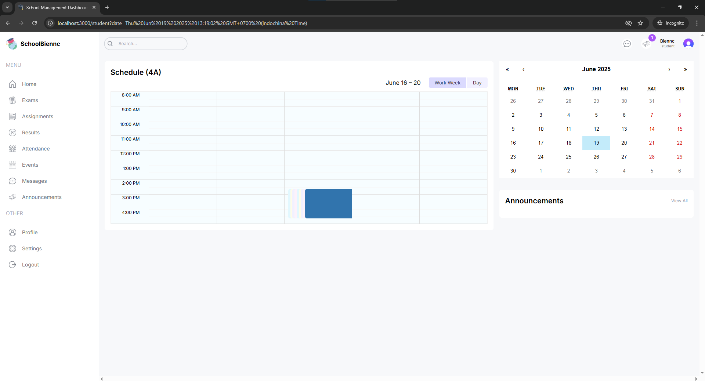

# School Management Dashboard

A comprehensive school management system built with Next.js 14, TypeScript, Tailwind CSS, Prisma, and Clerk Authentication.

## Features

### Role-Based Access Control
- **Admin Dashboard**: Complete overview with statistics, user management, and system controls
- **Teacher Portal**: Schedule management and student tracking
- **Student Portal**: Class schedules and academic information
- **Parent Access**: Monitor student progress and announcements

### Key Functionalities
- 📊 Interactive Dashboard with Charts
- 📅 Dynamic Calendar System
- 👥 User Management (Admin/Teacher/Student/Parent)
- 📢 Announcement System
- 📋 Attendance Tracking
- 📝 Event Management
- 💰 Financial Overview
- 📈 Performance Analytics

## Tech Stack

- **Frontend**: Next.js 14, React, TypeScript, Tailwind CSS
- **Backend**: Next.js API Routes
- **Database**: PostgreSQL with Prisma ORM
- **Authentication**: Clerk
- **State Management**: React Hooks
- **Styling**: Tailwind CSS
- **Charts**: React Charts

## 📸 ScreenShots




## Getting Started

### Prerequisites
- Node.js 18+ installed
- PostgreSQL database
- Clerk account for authentication

### Environment Setup

1. Clone the repository:
```bash
git clone <repository-url>
cd fullstack-school-management
```

2. Install dependencies:
```bash
npm install
```

3. Create a `.env.local` file in the root directory with the following variables:
```env
# Clerk Authentication
NEXT_PUBLIC_CLERK_PUBLISHABLE_KEY=your_publishable_key
CLERK_SECRET_KEY=your_secret_key
NEXT_PUBLIC_CLERK_SIGN_IN_URL=/sign-in
NEXT_PUBLIC_CLERK_SIGN_UP_URL=/sign-up
NEXT_PUBLIC_CLERK_AFTER_SIGN_IN_URL=/
NEXT_PUBLIC_CLERK_AFTER_SIGN_UP_URL=/

# Database
DATABASE_URL="your_postgresql_connection_string"
```

4. Set up the database:
```bash
npx prisma generate
npx prisma db push
```

5. Run the development server:
```bash
npm run dev
```

Open [http://localhost:3000](http://localhost:3000) with your browser to see the result.

## Project Structure

```
src/
├── app/                    # Next.js app directory
│   ├── (dashboard)/       # Dashboard routes
│   │   ├── admin/        # Admin dashboard
│   │   ├── teacher/      # Teacher dashboard
│   │   ├── student/      # Student dashboard
│   │   └── parent/       # Parent dashboard
│   └── [...sign-in]/     # Authentication pages
├── components/            # React components
├── lib/                   # Utility functions and configurations
└── middleware.ts         # Authentication middleware
```

## Features in Detail

### Admin Dashboard
- User statistics with interactive charts
- User management for all roles
- Financial overview
- Event calendar management
- System-wide announcements

### Teacher Dashboard
- Class schedule management
- Student attendance tracking
- Announcement creation
- Event participation

### Student Dashboard
- Personal class schedule
- Attendance record
- Event calendar
- Announcement view

## Contributing

1. Fork the repository
2. Create your feature branch
3. Commit your changes
4. Push to the branch
5. Open a Pull Request

## License

This project is licensed under the MIT License - see the LICENSE file for details.

## Acknowledgments

- [Next.js Documentation](https://nextjs.org/docs)
- [Clerk Authentication](https://clerk.com/docs)
- [Prisma Documentation](https://prisma.io/docs)
- [Tailwind CSS](https://tailwindcss.com/docs)